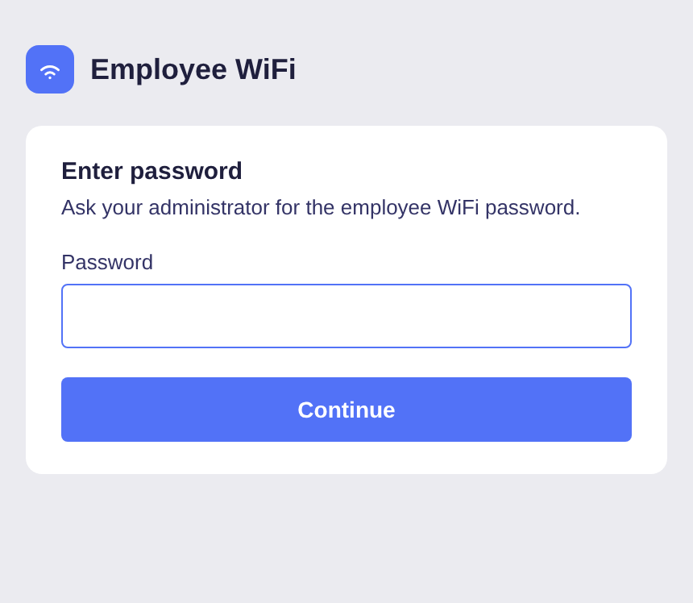
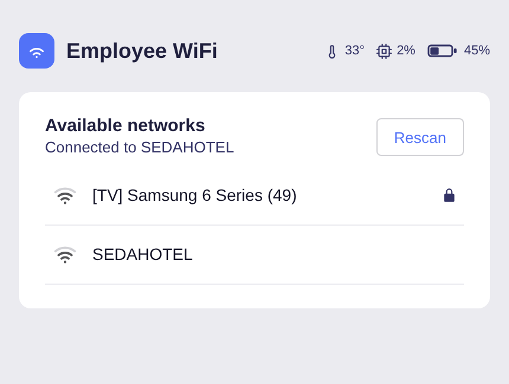
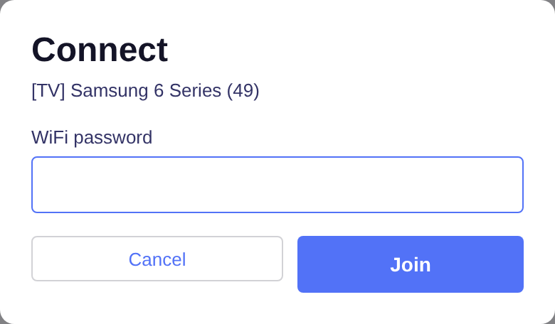
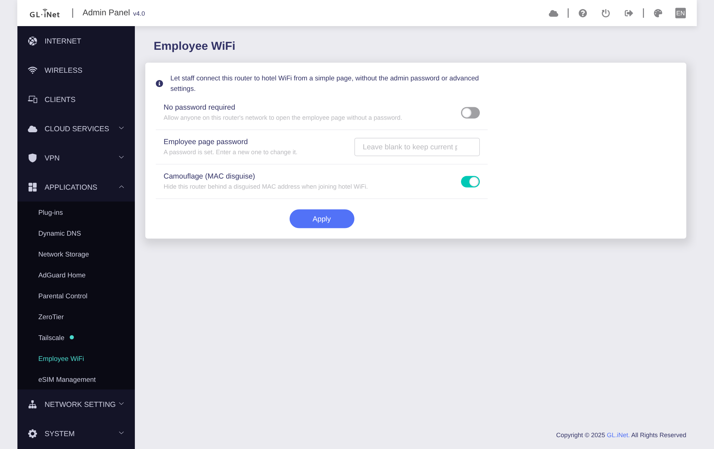
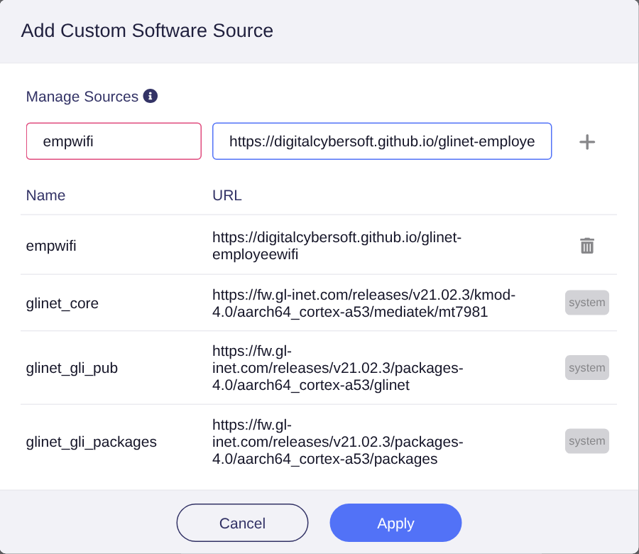
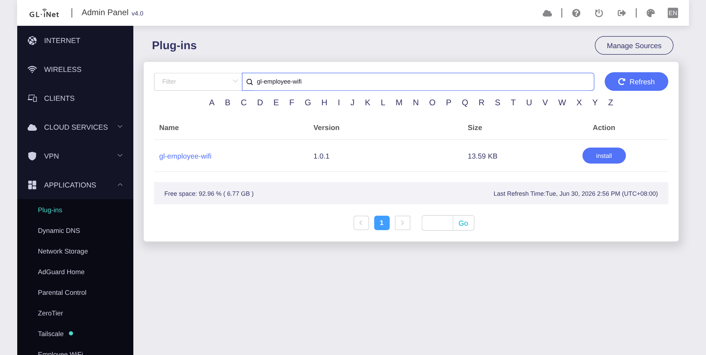

# Employee WiFi

A dead-simple page that lets staff connect a GL.iNet travel router to guest WiFi — at a
hotel, conference, cafe, anywhere — **no admin password, no advanced settings**. They scan,
tap a network, type its password, and they're online.

The employee page (`/wifi`):

  
  
  

The admin page — a native entry in the GL.iNet admin (Applications → Employee WiFi):

  

## What it does

- Adds a public page at **`/wifi`** for employees: scan → pick → password → connected.
- Shows live **device status** on that page: temperature, battery level and charging state,
  and CPU load (each appears only where the hardware reports it).
- Adds an **Employee WiFi** page in the router admin (Applications) where you set the
  employee password, turn the password off, toggle camouflage, and set an optional
  **message banner** for the employee page.
- Joins the chosen network as the router's uplink (repeater) with camouflage on.
- That's the whole feature. No band selection, no channels, no advanced WiFi settings.

## Install (the easy way)

It's a normal plug-in, served from this repo's GitHub Pages feed. On the router, open
**Plug-ins**, add a software source, then install:

- Name: `empwifi`
- URL: `https://digitalcybersoft.github.io/glinet-employeewifi`

   Manage Sources)" />

Refresh the list, find `gl-employee-wifi`, and click **install**:

  

That's it. (Same thing from SSH if you prefer:
`echo 'src/gz empwifi https://digitalcybersoft.github.io/glinet-employeewifi' >> /etc/opkg/customfeeds.conf && opkg update && opkg install gl-employee-wifi`.)

> The feed is built and published automatically by `.github/workflows/publish.yml` (GitHub
> Pages, Source: GitHub Actions). Bump the version in `pkg/control` and push to republish.

## For the admin

Open **Applications → Employee WiFi**:

- A **random employee password is generated on install** and shown on this page. Hand it
  to staff, or replace it with your own.
- **No password required** for trusted setups (this also skips the generated password).
- **Camouflage** on by default (hidden behind a disguised MAC), where the device supports it.
- An optional **message banner**: type a short note and choose who sees it on the employee
  page (everyone, only before login, or only after login).

## Requirements

- GL.iNet firmware **4.x** (the current web UI). Tested on the GL-XE3000 (fw 4.8.3) and the
  GL-MT1300 Beryl (fw 4.3.19); built architecture-independent (`Architecture: all`), so it
  runs on the wider 4.x family (Opal, Slate, Flint, …). The installer stops cleanly on a
  device that can't run it.

## Built to stay small and simple

- **No build toolchain.** Lua + a little hand-written JS + JSON, packaged with `tar`/`gzip`.
  Rebuild with `./pkg/build.sh` — no npm, no webpack, no cross-compiler.
- **~13 KB** installed, **no background process**.
- **Survives firmware updates**: the package keeps its own files and settings across a
  "keep settings" flash.

## Security in one paragraph

The employee page is reachable by anyone on the router's LAN, so all enforcement lives in
the backend and the page is never trusted: a password check (a random one is set at
install, minimum 8 characters), a short-lived token, login rate-limiting, a CSRF guard, and
strict input validation. Employee actions can only scan and join a network, never the
router's advanced settings or admin RPC. The page also reads basic device status
(temperature, battery, CPU load) for display only; this exposes no settings and no
credentials. Use "no password required" only on networks you trust.
